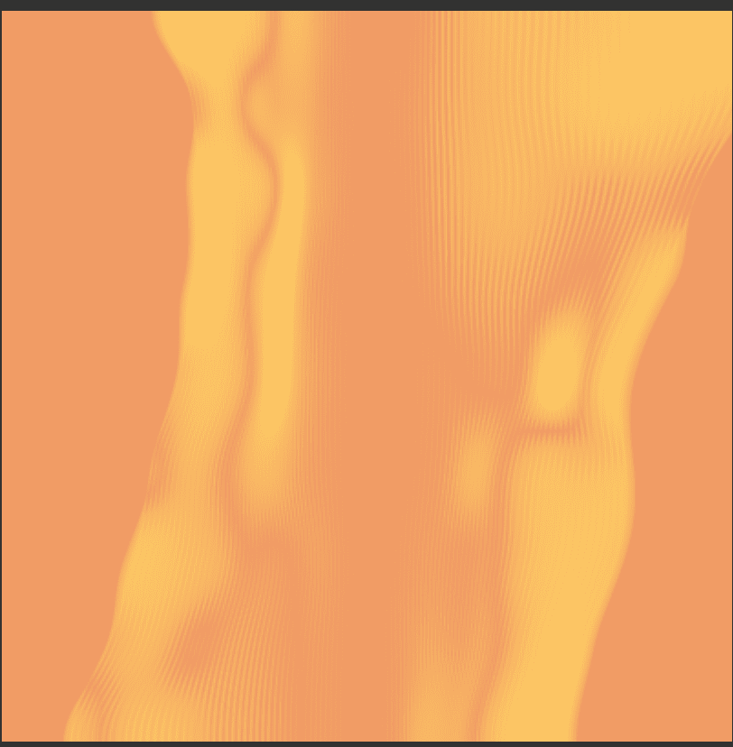

# processed (art): mirage

▶ 什么是加工（艺术）：海市蜃楼？
已处理（艺术）：海市蜃楼是一个 NFT（不可替代代币）集合。存储在区块链上的数字艺术品集合。
▶ 有多少已处理（艺术）：海市蜃楼代币存在？
总共有 768 个已处理（艺术）：海市蜃楼 NFT。目前，506 位所有者至少拥有一种已处理的（艺术品）：钱包中的 mirage NTF。
▶ 最昂贵的加工（艺术品）是什么：海市蜃楼？
最昂贵的加工（艺术品）：出售的 mirage NFT 是 mirage #227。它于 2022-08-07（27 天前）以 0.1 美元的价格出售。
▶ 加工（艺术）：海市蜃楼最近卖出了多少？
有 4 个已处理（艺术）：在过去 30 天内售出的 Mirage NFT。

