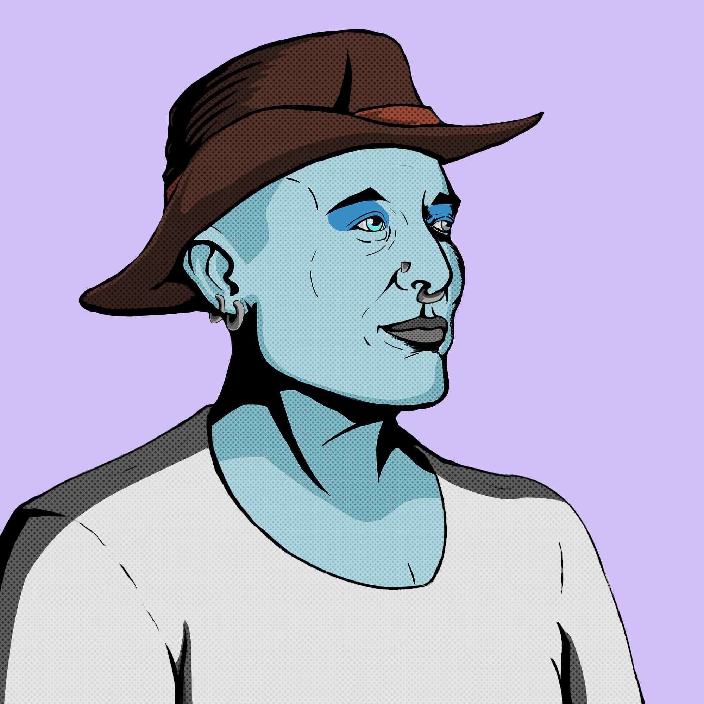

# Professor Elon Rocket Factory

Elon Rocket Factory 教授是以太坊 (ERC-721) 区块链上 9,999 个独特 NFT 的集合。每一件都是独一无二的，由 Elon 教授亲自精心设计和挑选。他是世界上最全能的人，无所不知。未来的麦哲伦，他将把我们带到宇宙的尽头，进入遥远的未来。我们制作的作品试图表现出一种模仿。完全讽刺、模仿、模因和流行艺术。如此说来，我们亲爱的埃隆勋爵将带领我们走上正确的道路。无论是月球还是火星，甚至是最远的恒星。无论我们去哪里，我们都知道Papa Elon 不会很远。因此，与我们身边的 Doge 同伴一起，系好安全带，因为这将是一场疯狂的旅程！

