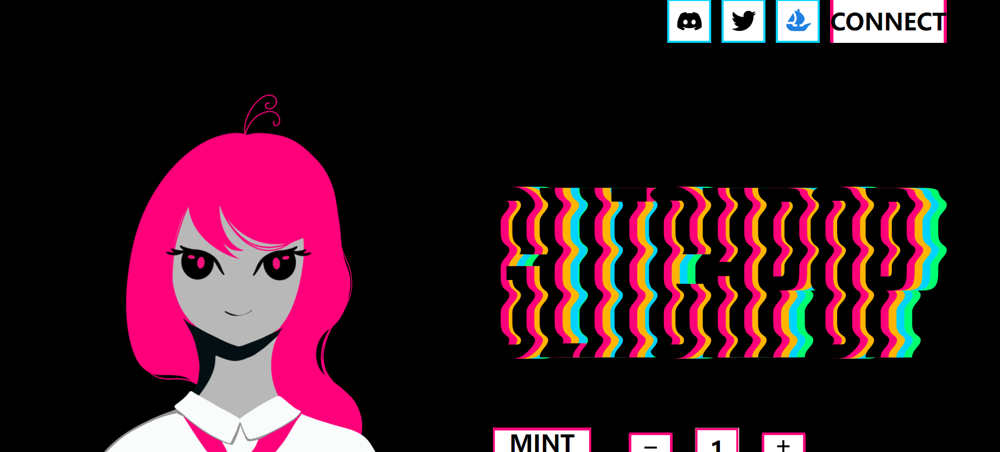

# Project Glitchpop

GLITCHPOP 项目是我们的 2200 GENESIS 手绘和生成艺术项目。它基于偶然发现以太坊虚拟世界的梦想世界的女孩。我们是一个新的和即将到来的项目/团队，旨在提供一个独特的艺术生态系统。我们的 2200 Genesis 系列将成为获取我们想要提供的未来系列的关键部分，并将跟随这些女孩在神秘的梦想世界中面临的旅程和挑战。

正如他们所说，没有路线图，没有承诺。

我们希望将艺术作为我们的首要任务，并在其背后建立一个欣赏艺术并可以期待更多的社区。由于我们目前已经支付了一部分供应，我们希望能够帮助继续激励我们的艺术家实现她的梦想，并有史以来第一次为她的作品获得报酬。我们了解市场状况并将相应调整，但因此我们希望在未来回馈社区和所有决定加入我们这一旅程的人，提供伟大的艺术和我们这些人可以享受的完全免费的薄荷糖。

在我们的 Project Glitchpop GENESIS 之后，我们已经在进行工作，这是一个次要系列，将跟随这些女孩在梦想中的虚拟世界中的转变。我们希望通过艺术继续讲述这个故事。有关这方面的更多详细信息将在我们首次发布后不久发布，但将 100% 完全免费。普通的日常女孩，在睡梦中醒来，进入了虚拟世界的梦想世界。现在他们必须在为时已晚之前找到摆脱这些梦想的方法......

