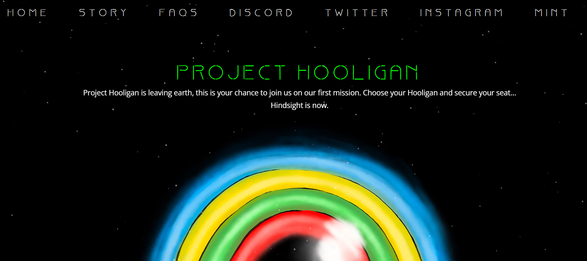

# Project Hooligan: Gen 1

朋克、猿甚至其他一些人已经从零变成了英雄，而加密平民几乎没有空间。好吧，现在轮到你搭便车到山顶了。Project Hooligan 的建立是基于这样一种理解，即我们共同拥有更好的机会，并赋予人民权力。流氓社区的力量是我们引导这艘生锈的老灰狗飞船登上月球所需的燃料。不要成为下一个 NFT 运动的旁观者，成为其中的一部分。 
流氓：第 1 代
一组 789 个程序化独特的 NFT，生活在以太坊区块链上。一个由来自这个世界的加密货币和 NFT 爱好者组成的社区，以吸引所有希望破坏 Metaverse 的人。

