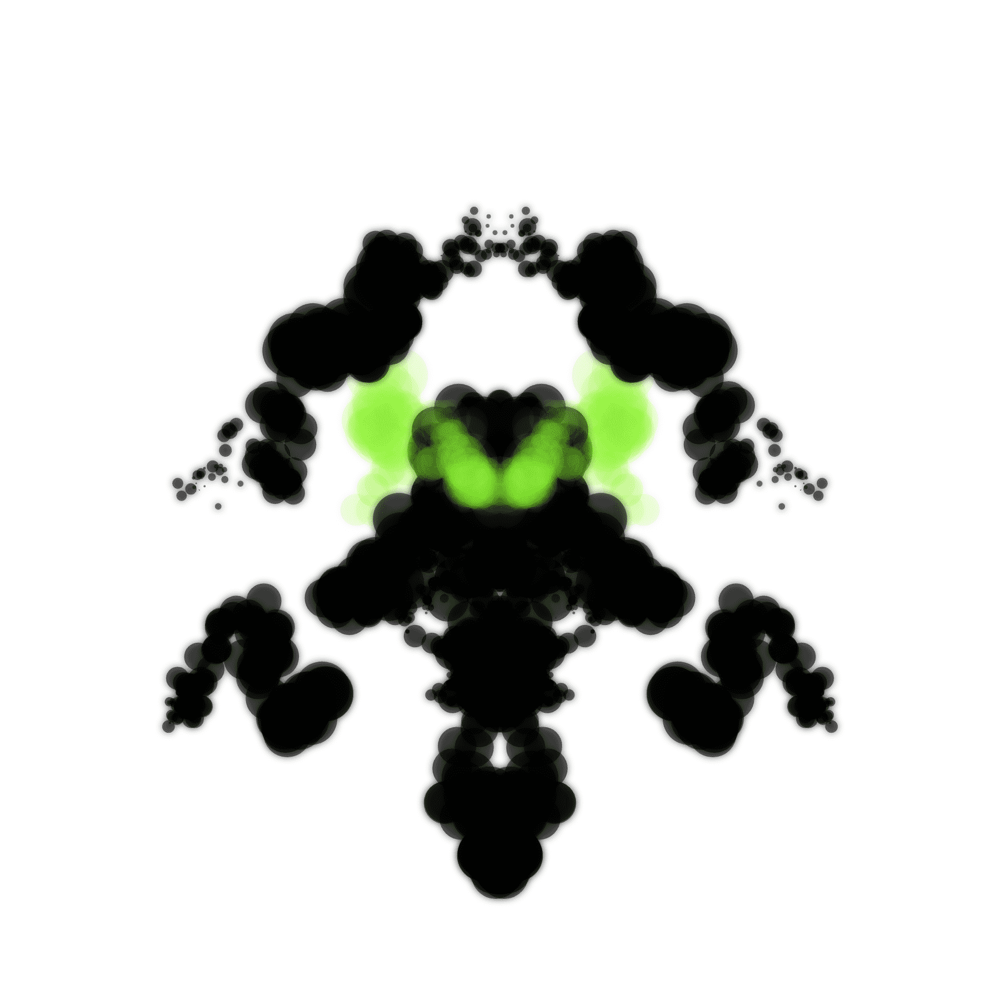

# Project INK

收集受罗夏测验启发的生成墨迹艺术。尽管外观随机，但每个人都会投射出自己的个性和情感，进而会以不同的方式感知每个墨迹。要重命名代币，请使用etherscan或网站上的合约。要为您的 INK 设置动画，请重命名您的令牌并用 [方括号] 将名称括起来，然后等待一两分钟让 gif 首次生成。准备就绪后，单击令牌页面右上角的“刷新元数据”按钮以查看 Opensea 上的更改。

