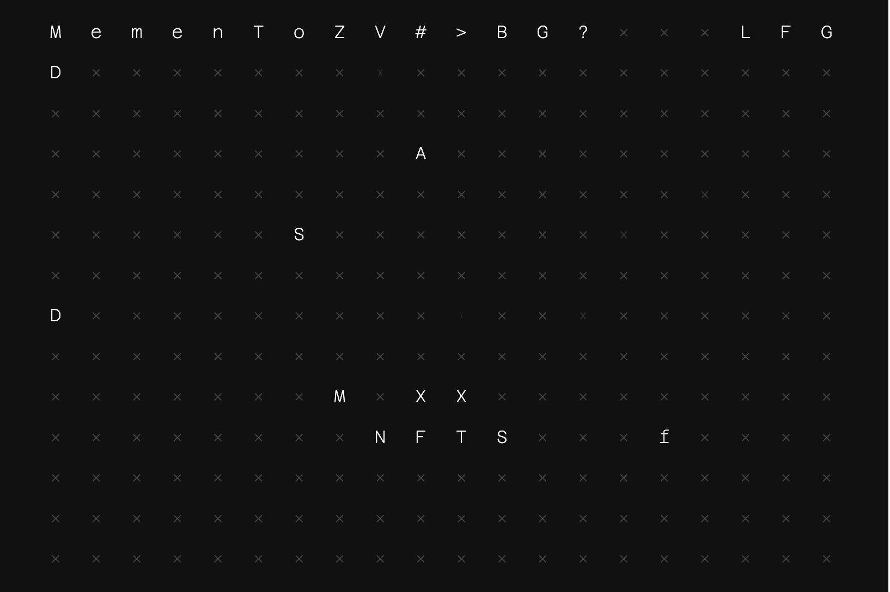

# Project Memento

**什么是 Project Memento纪念品计划？**

在纪念品墙上留下痕迹，Project Memento 包含 400 个 NFT。每个 NFT 在 Memento 网格上都有自己独特的坐标。拥有它使您有权更改其坐标中的角色。

第一个铸币厂从 0.01 ETH 开始。每次铸币后，下一次铸币的价格将乘以 1.1，直到达到 2ETH 的上限。这意味着早期买家将获得最便宜的价格。

购买 NFT 后，您可以随意更改其中的角色。NFT 也将在 Opensea 上提供，您将能够收到它的报价。
一旦项目达到其目标（所有瓷砖都已填满），每个 NFT 所有者将收到一幅独特的、真实的绘画，他们拥有的字母与其他字母不同。

