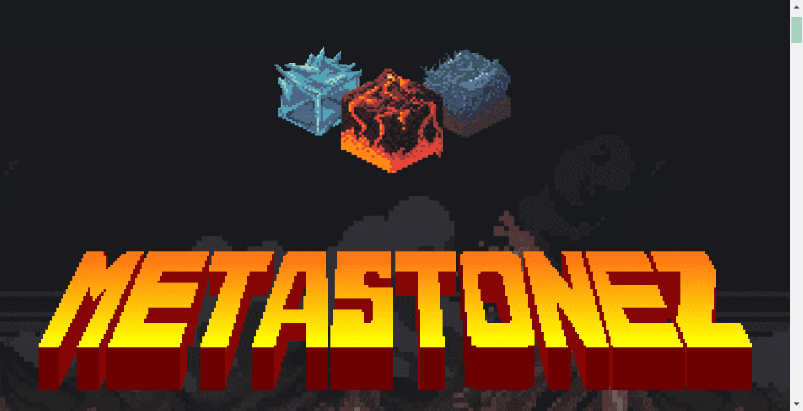

# Project MetaStonez

MetaStonez 是从地球升起的基于像素的生物。我们的存在是为了扩展 Stoneverse，让 NFT 收藏家、艺术家和开发者有机会参与这一旅程。
MetaStonez 是在以太坊区块链上生成的不可替代代币项目。MetaStonez 存在于 100x100 像素的容器中，描绘了从自然元素中诞生的石巨人，包括火成岩和贵金属。MetaStonez 的特征和品种非常多，因为只有 10101 MetaStonez 存在。其中，有 1321 Genesis Stonez 和 8760 Origin Stonez。

MetaStonez 的每一次社区合作都利用了空间内独特的互操作性。这些合作伙伴关系包括但不限于直接整合到各自的虚拟世界、即将推出的掉落和收藏中的功能、MetaStonez 和合作伙伴持有者独有的跨界收藏，以及对未来薄荷糖、商品和其他整合利益的独家访问。

