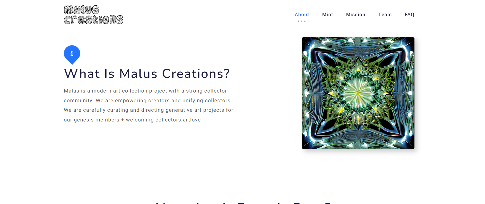

# Project Radiance by Omar Wael

 Malus 是一个拥有强大收藏社区的现代艺术收藏项目。我们正在赋予创作者权力并统一收藏家。我们正在为我们的创世纪成员精心策划和指导生成艺术项目 + 欢迎收藏家.artlove
我们的使命是彻底改变艺术收藏。我们希望让收藏家有机会以最低的成本构建完整的收藏。我们的创世纪空间频率下降是切入点。

我们的使命是通过专门为我们的 Spatial Frequency 持有者提供的每月新品，帮助收藏家建立各种 NFT 艺术风格的完整收藏。

随着月度下降，我们相信我们的持有者将具有不可否认的价值。

我们的使命是帮助新的 NFT 艺术收藏家建立完整的收藏。

项目：Radiance 是我们的第二次下降，将是第一个免费为空间频率持有者铸造的。

