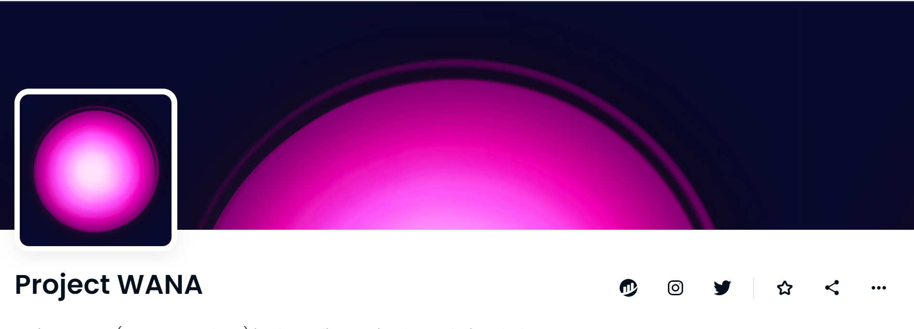

# Project WANA

▶ 什么是 WANA 项目？
WANA 项目是一个 NFT（不可替代代币）集合。存储在区块链上的数字艺术品集合。
▶ 有多少个 WANA 项目代币？
总共有 2 个 WANA NFT 项目。目前，15 位所有者的钱包中至少有一个 Project WANA NTF。
▶ 最昂贵的 WANA 项目销售是什么？
售出的最昂贵的 WANA NFT 项目是 Self Discovery。它于 2022-06-04（3 个月前）以 182 美元的价格售出。
▶ 最近卖出了多少 Project WANA？
过去 30 天内售出了 3 个 Project WANA NFT。

