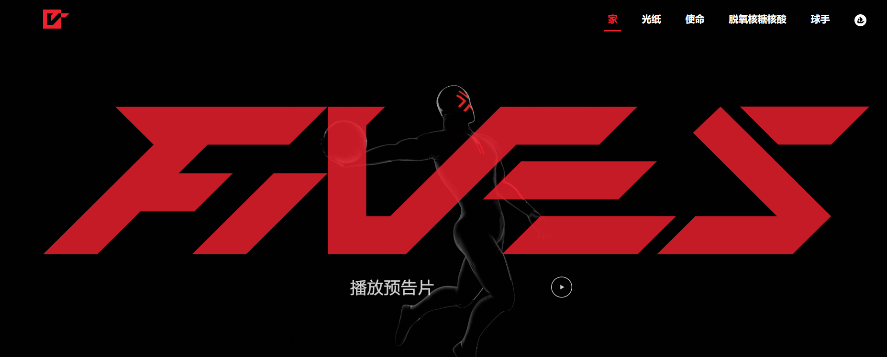

# FIVES

FIVES是一款将于 2023 年初发布的手机篮球游戏（想想 NBA Jam 遇到了加密货币）。 FIVES Baller DNA是 5 位篮球运动员的列表，他们的技能相结合，创造了您的 Baller。没有 DNA，您无法铸造 Genesis Baller。您的 Ballers 技能和游戏风格将反映用于创造它的 DNA。使用您的 Baller 在线竞争，并在获胜时赚取 NFT。

很久没有一场精彩的篮球比赛了。尽管其他行业都在围绕它们发展，但大型工作室仍拥有独家授权，年复年地推出FIVES将竞争性移动游戏与NFT驱动的经济结合起来。想想NBA Jam遇到了加密货币。FIVES 将完全免费玩，但免费玩家的定制和收入潜力有限。这种模式在英雄联盟和堡垒之夜等游戏中得到普及:玩款有趣的免费游戏，可以通过皮肤获利。

