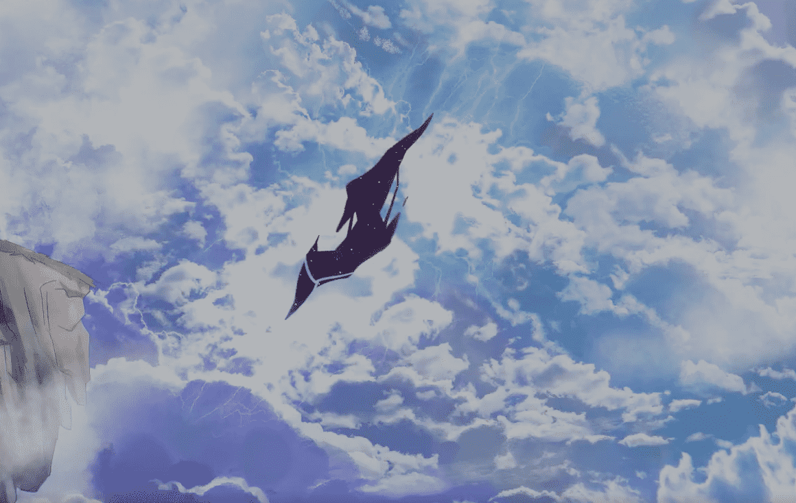

# Kosekai Collective

Kosekai Collective 是一组手绘的奇幻冒险家，他们将踏上探索沉浸感、创造力和表达的旅程——从而实现个性化的成长。 JRPG、日本动漫和创新技术的巅峰之作激发了故事和品牌的灵感，以培养一种根深蒂固的 web3 体验。 该项目旨在通过社区的创新体验和进一步的实用功能丰富的功能将断开连接的虚拟世界整合在一起。
Kosekai Collective 是一个由 999 名冒险家组成的故事和社区驱动的 NFT 集合。 我们最初的 Web3 系列将通过精心策划的冒险来改变虚拟世界，为受幻想启发的项目提供平台，并积极为社区提供有价值的实用功能丰富的功能。 超过 500 个特征是手绘的，以提供身临其境的体验，使每个 NFT 都有自己独特的身份。

