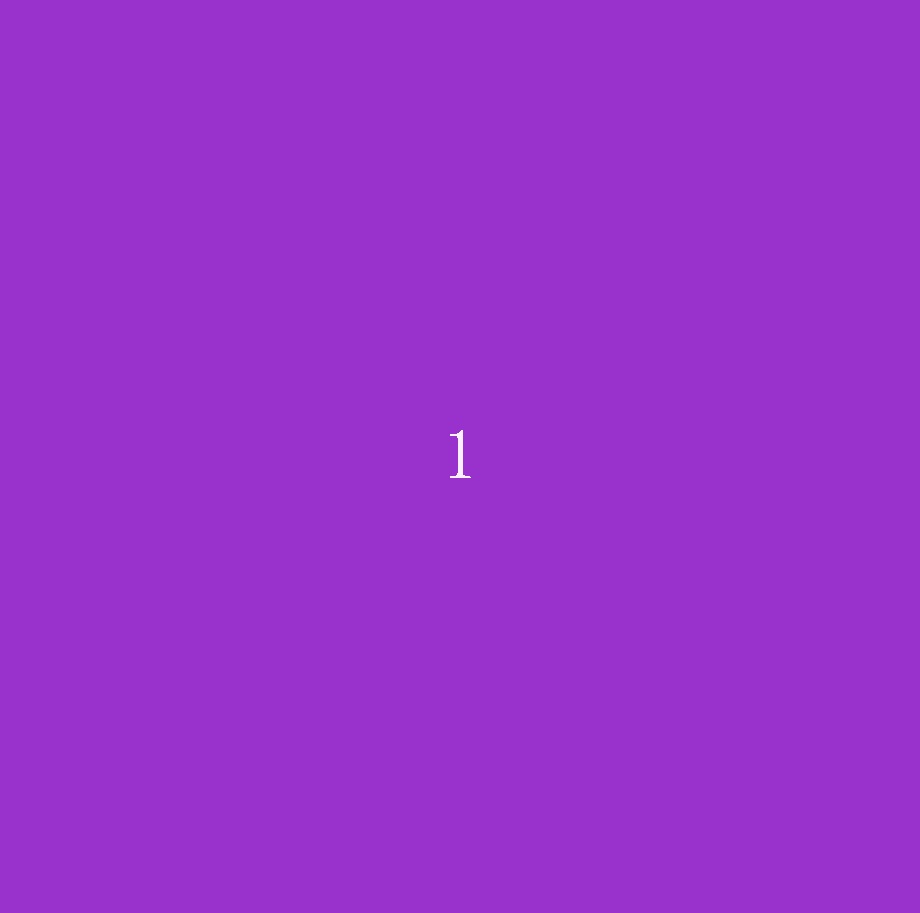

# ProjectLevelUp

项目 LevelUp 铸造了一个具有基本背景的零水平。 您可以使用 12 种不同的背景颜色升级多达 1024 个级别。 每次达到新的以 2 为底的指数级别时，背景颜色都会发生变化。 随着等级的提高，背景变得越来越难改变。 你能走多高？
常问问题
如何声称我的水平？
在合同上使用索赔功能（使用上面的链接）。
如何升级？
合约上有两个功能。 使用 levelUpOne 函数只会升级一个级别。 传递您的令牌 ID（在公海上找到），填写 10 MATIC 进行付款。 您还可以使用 levelUp 功能一次升级更多级别以节省汽油费。 传递您的令牌 ID 以及您想要升级的级别以及正确的付款金额。
我在 Opensea 上看不到我的新关卡
每次升级时，都必须更新 opensea 上的元数据以反映更改。
背景颜色在什么级别发生变化
1, 2, 4, 8, 16 ... 1024

