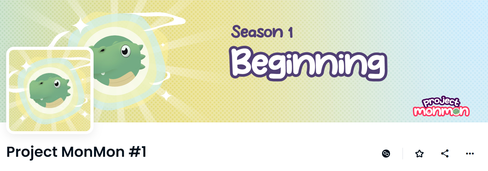

# Project MonMon #1

▶ 什么是项目 MonMon #1？
Project MonMon #1 是一个 NFT（不可替代代币）集合。存储在区块链上的数字艺术品集合。
▶ 有多少个 Project MonMon #1 代币？
总共有 50 个项目 MonMon #1 NFT。目前，14 位所有者的钱包中至少有一个 Project MonMon #1 NTF。
▶ 最近卖出了多少个 Project MonMon #1？
过去 30 天内售出了 0 个 Project MonMon #1 NFT。

