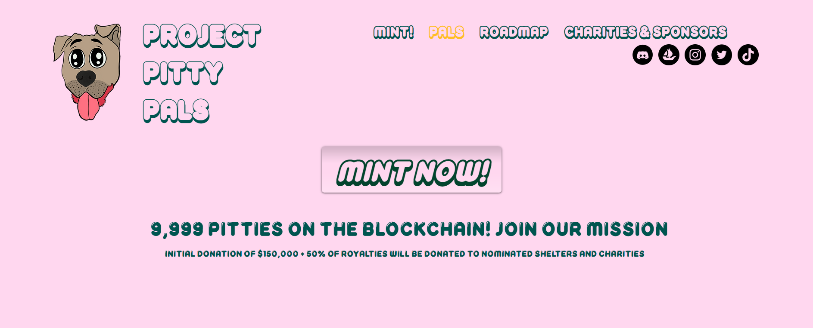

# Project Pitty Pals

Pitty Pals 项目由 9,999 个 NFT Pals 组成，具有 350 多个独特的特征。我们创建了 PPP 来为现实世界的狗救援、收容所和非营利组织提供帮助。建立一个由志同道合的个人组成的社区，他们关心在社区中产生影响并成为自己的声音！
Pitty Pals 没有结合曲线。9,900 Pitty Pals 在 0.04Ξ 时可用于白名单，在0.08Ξ时可用于薄荷。 剩下的 99 个 Pitty Pals 被保存用于营销！ 

