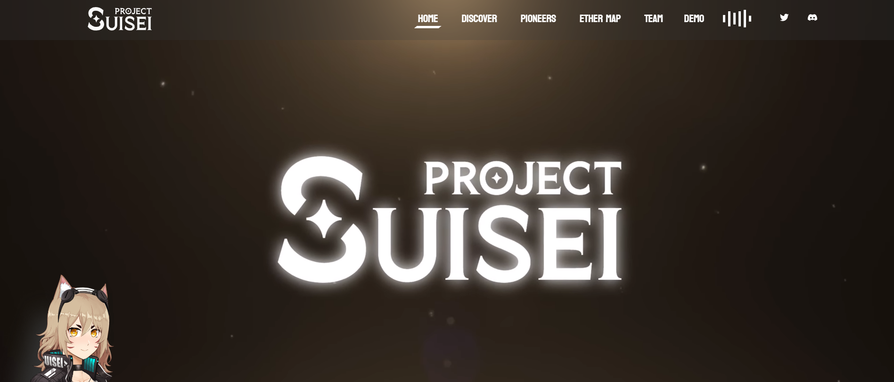

# Project Suisei Pioneers

5,555名流浪者已被转移到Suisei Metaverse。异国他乡既美丽又神秘。没过多久，他们才意识到命运为他们准备了什么。冒险、建造、战斗、结交新朋友，并在神秘世界中开辟新道路。后来的流浪者将他们称为"Suisei Pioneers"。

Suisei metaverse的灵感来自于著名的Ready Player One创造社交环境和生态系统的灵感。该风格的灵感来自我们团队最喜欢的游戏Genshin Impact。

随着Web3的发展速度如此之快，元界的未来发展仍然非常难以预测。因此，团队决定采用更灵活的方法，让Suisei成为未来计划中的任何事物。Suisei的支柱核心是专注于战斗基础游戏和社交平台，很容易吸引和接受大众。

