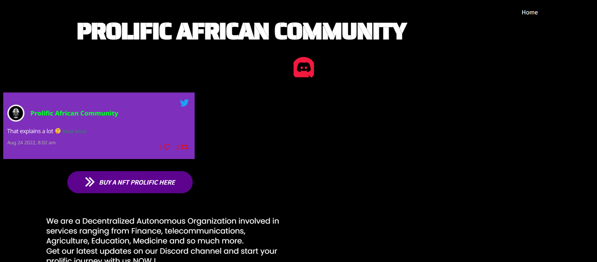

# Prolific African Community

社区是脆弱的。在我们的社区中，关键字是信任。

我们是一个去中心化的自治组织，我们的网络 100% 由区块链提供支持； 

我们的服务建立在 Hyperledger 之上；最先进的跨行业区块链，涉及 Linux 基金会、IBM、Visa 和微软等名称。

我们以去中心化的方式运作，诸如筹资、战略规划、支出和利润分配等决策都是通过社区在线安全投票来实现的。 

“持有”你的 NFT 使你有权获得社区奖励和福利。 

加入我们，通过智能合约建设非洲民主的未来。通过让一切都可追溯并确保我们自然资源的每一个单位都得到说明，我们希望实现完全透明和真正的经济主权。

您参与的项目包括银行、金融、教育、农业、网络安全、保险、治理等等。

在下面查看我们即将进行的准备大规模生产的项目和服务。

