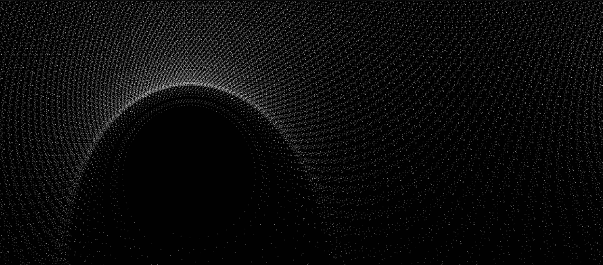

# PROOF OF {ART}WORK

交互式、基于软件的艺术和最早偏离简单图像和视频格式的 NFT 集合之一。
{艺术证明}作品是由一个简单等式得出的数学实体：z_n -> {z_n}^2 + z_0
这些 NFT 不是图像，而是绘制在 2D 空间上的数百万个点的可探索星系。PO{A}W 使用定制软件按需探索这些，灵感来自支持 Google 地图的逻辑。
PO{A}W 是链上 NFT 集合的早期示例，其令牌 ID 代表上述等式的唯一 z_0 值。由于美观的 ID 很少见，而且必须随机找到，因此它们的发现可以被视为类似于区块链挖掘——获得艺术证明的奖励。

