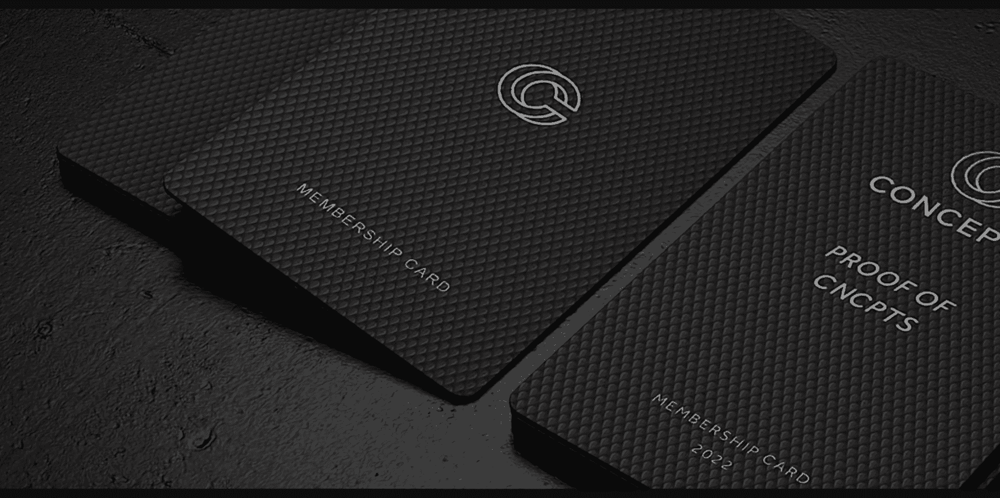

# Proof of CNCPTS

CNCPTS NFT 证明 - 常见问题 (FAQ)
▶ 什么是 CNCPTS 证明？
CNCPTS 的证明是一个 NFT（不可替代令牌）集合。存储在区块链上的数字艺术品集合。
▶ 存在多少个 CNCPTS 代币证明？
总共有 1,996 个 CNCPTS NFT 证明。目前，1,306 位所有者的钱包中至少有一份 CNCPTS NTF 证明。
▶ 最昂贵的 CNCPTS 销售证明是什么？
出售的最昂贵的 CNCPTS NFT 证明是 CNCPTS #333 的证明。它于 2022-06-05（3 个月前）以 223.8 美元的价格售出。
▶ 最近卖出了多少 CNCPTS 的 Proof？
过去 30 天内售出了 261 个 CNCPTS NFT 证明。
▶ CNCPTS 证明的成本是多少？
在过去 30 天里，最便宜的 Proof of CNCPTS NFT 销售额低于 110 美元，最高销售额超过 191 美元。在过去 30 天内，CNCPTS NFT 证明的中位数价格为 158 美元。
▶ CNCPTS 替代方案的流行证明是什么？
许多拥有 CNCPTS NFT 证明的用户还拥有 Kith Friends、 BOBO DEGEN APOCALYPSE、 popoPOPOpopo和 illdoit。

