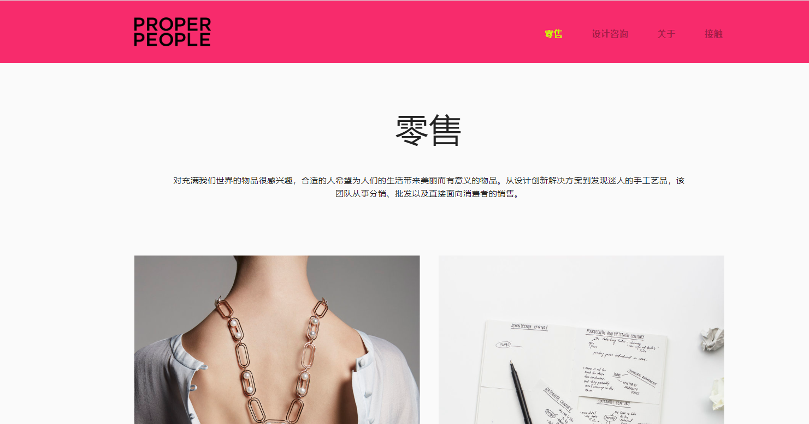

# Proper People

PROPER PEOPLE 由两位设计师创立，他们寻找一个空间来表达他们看待世界的方式，收集新的体验，当然还有谋生。

他们希望通过工作讲述故事，同时向与他们一起工作的人学习和成长。他们不断好奇不同的人是如何工作的，是什么驱动他们，以及如何融合不同的方法来进一步推动创意和创业的界限。

**创始人**

林瑞银是一名在伦敦中央圣马丁学院接受培训的珠宝商，师从 Caroline Broadhead 和 Naomi Filmer 等当代珠宝界的重量级人物。

Afzal Imram 在新加坡国立大学接受了工业设计专业的培训，师从新加坡领先的设计师和思想家，如 Patrick Chia 和 Christian Boucharenc 博士。

