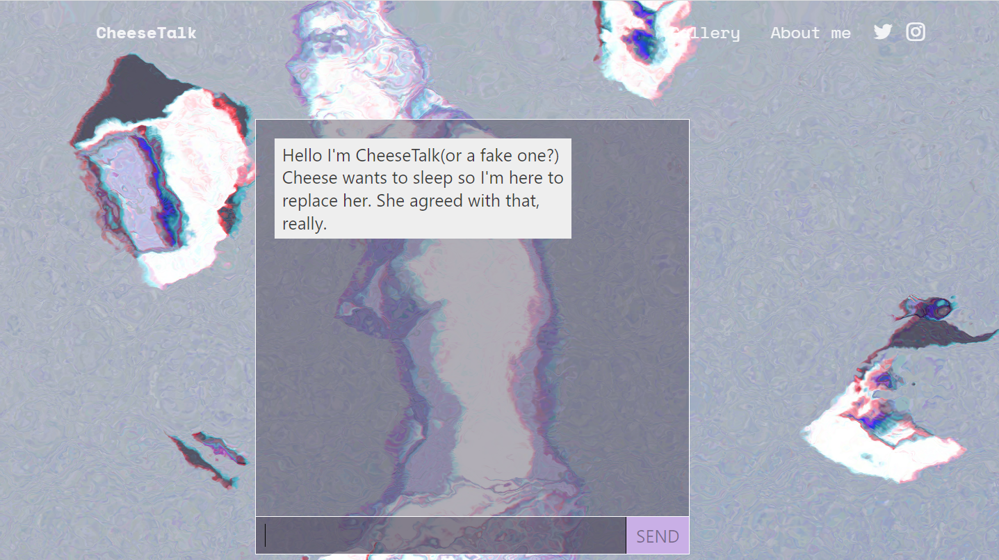

# Protoplasm

孙玉倩（CheeseTalk）是中国人工智能艺术家和研究员，毕业于清华大学和金史密斯学院。现为英国皇家艺术学院博士生，rct.ai艺术顾问。

受视频游戏中虚拟角色之间对话的启发，她创作出充满好奇心的作品。她的主要艺术项目专注于人工智能聊天机器人，探索人类与人工智能互动中的叙事和亲密关系。

她的作品和研究曾在包括2020人工生命、叶利钦中心媒体立面、数字游戏基金会（FDG）、ISEA、ACM多媒体、柏林BBA画廊、上海艾三艺术中心和纽约时代广场在内的画廊和会议上展出。她的人工智能作品也入围了 2022 年流明奖。

她于 2022 年 2 月推出 SuperRare，并成为 World of Women 的空投合作艺术家。她的作品已被 WOW 团队收藏，并在纽约时代广场展出。

