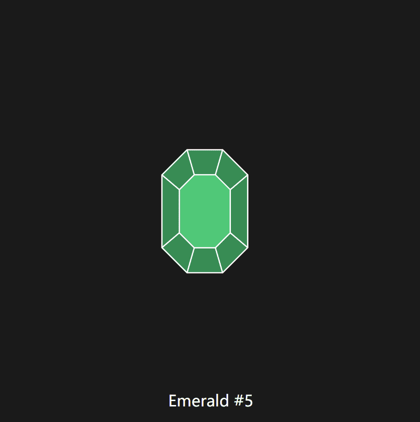

# Provably Rare Gem

Provably Rare Gem 是一种无需许可的链上资产，可供铁杆收藏家挖掘和收藏。 必须使用链下工作证明来开采宝石。 宝石稀有度越高，越难被发现。 故意省略统计信息和其他功能以供其他人解释。 由 swit.eth 与 Alpha Finance Lab 合作创建。
可证明稀有宝石 NFT - 常见问题 (FAQ)
▶ 什么是可证明的稀有宝石？
Provably Rare Gem 是一个 NFT（不可替代令牌）集合。 存储在区块链上的数字艺术品集合。
▶ 有多少可证明稀有的宝石代币？
总共有 20 个可证明的稀有宝石 NFT。 目前，1,426 位所有者的钱包中至少有一个 Provably Rare Gem NTF。
▶ 最近售出了多少可证明稀有宝石？
过去 30 天内售出了 0 个可证明稀有宝石 NFT。

