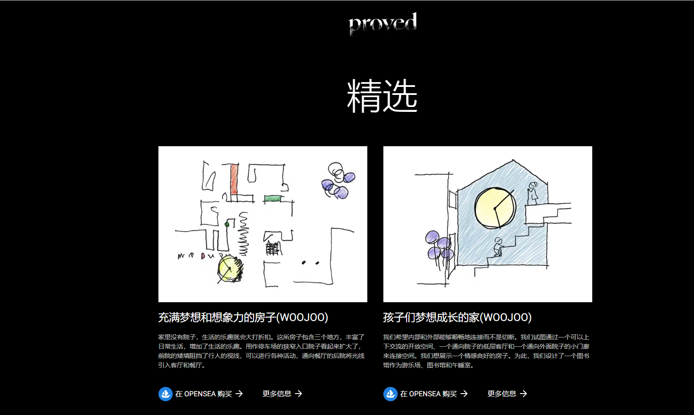

# Proved NFT

Proved 是第一个旨在介绍现实世界架构哲学的架构设计 NFT 项目。全球建筑师将通过 Proved NFT 分享他们独特的创作。该项目将涵盖建筑设计的各个方面——从建筑师为他在首尔的 5 层建筑绘制的草图，到几何上不可能构建的获奖建筑师的数字绘图。

充满梦想和想象力的房子(WOOJOO)
家里没有院子，生活的乐趣就会大打折扣。这所房子包含三个地方，丰富了日常生活，增加了生活的乐趣。用作停车场的狭窄入口院子看起来扩大了，前院的矮墙阻挡了行人的视线，可以进行各种活动，通向餐厅的后院将光线引入客厅和餐厅。

孩子们梦想成长的家(WOOJOO)
我们希望内部和外部能够顺畅地连接而不是切断。我们试图通过一个可以上下交流的开放空间、一个通向院子的低层客厅和一个通向外面院子的小门廊来连接空间。我们想展示一个情感良好的房子。为此，我们设计了一个图书馆作为游乐场、图书馆和午睡室。

