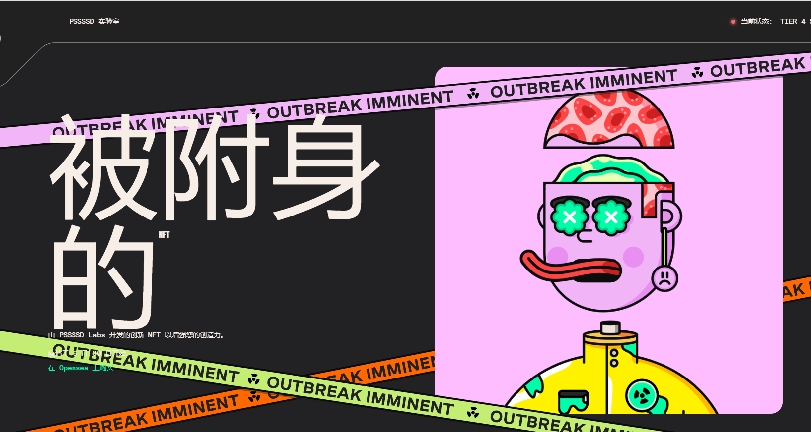

# The Possessed By Pssssd Labs

创造力我们相信每个出生的人都拥有创造力。当我们 3 岁时，我们的想象力、好奇心和创造力空前高涨。随着我们年龄的增长，它是由我们教育出来的。我们相信创造力和激情是充实生活的重要组成部分，这就是为什么我们所做的一切都是为了帮助您拥抱您富有创造力的内在小孩。

社区人际交往是充实生活的另一个重要组成部分。发现与您有共同爱好并与他们一起成长的人会产生真正的意义。我们正在建立一个互相照顾并鼓励彼此成为最好的社区的社区。

合作当我们一起工作时，伟大的事情就会发生。真正的协作是多方联合起来创造比其部分总和更大的东西。互相挑战以新的方式进行实验会产生意想不到的结果——而创新来自意想不到的结果。

