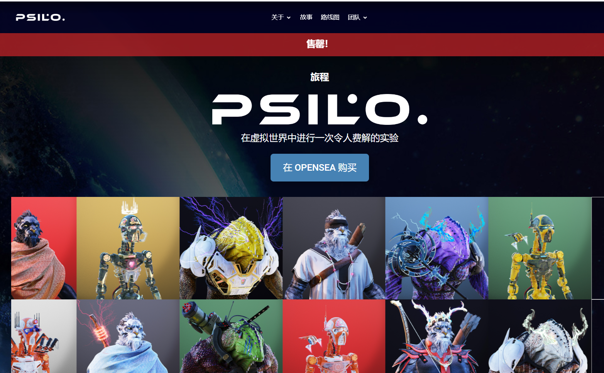

# PSILO-Official

Psilo 是您的首屈一指的虚拟世界化身项目，由三种超级独特的 3D 角色组成。然而，Psilo 不仅仅是一个 NFT 集合——它是一个运动。我们正在采用令人惊叹的 3D 艺术，一个致力于支持心理健康的 web3 平台，并创建一个科幻系列。NFT 只是 Psilo 帝国的开始。

我们的使命是帮助阐明快速发展的试验和疗法，这些试验和疗法涉及使用迷幻药来对抗心理健康危机。

Psilo 来自 Psilocybin 这个词，一种在 Psilocybe 属的蘑菇中发现的致幻生物碱，目前正在研究帮助患有 PTSD、成瘾、抑郁和焦虑的人。这是心理健康的未来。从 2,222 个 NFT 的创世集合中铸造出每个 Psilo NFT，1% 的收益将捐给迷幻研究多学科协会 (MAPS)。我们相信赛洛西宾是自然界最强大的生态改善和人类康复工具之一。

我们对约翰霍普金斯大学、加州大学洛杉矶分校、伯克利迷幻科学中心 (BCSP) 和许多其他机构的出色工作感到兴奋。我们一直是 MAPS 的忠实粉丝，并希望捐款支持他们的使命。

