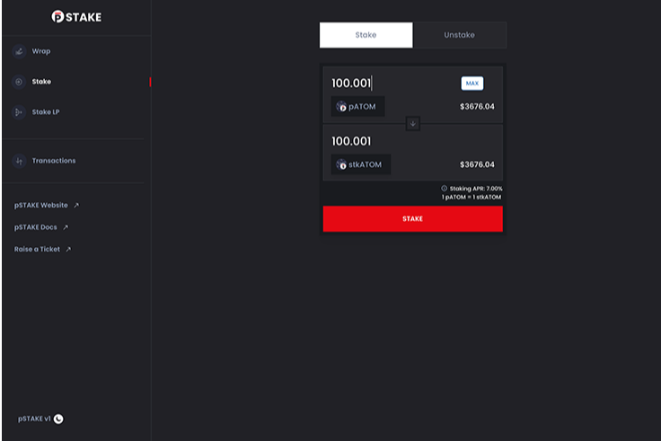

# pStake Finance

**什么是 pStake Finance？**

pSTAKE是一种流动性质押解决方案，通过释放质押资产的流动性来释放 PoS 代币的真正潜力。通过 pSTAKE，Persistence 的目标是占领 600B 美元的 PoS 资产市场。支持 Cosmos、Persistence、Luna、Solana 和 Ethereum 等资产。

**特征：**

##### 解锁流动性

质押和接收交易，以保持原本锁定资产的流动性

##### 杠杆 Defi

使用液体 stkASSET 探索 DeFi 机会，同时获得质押奖励

##### 即时赎回

通过直接将存托交换为原生资产，跳过解压和解绑过程

