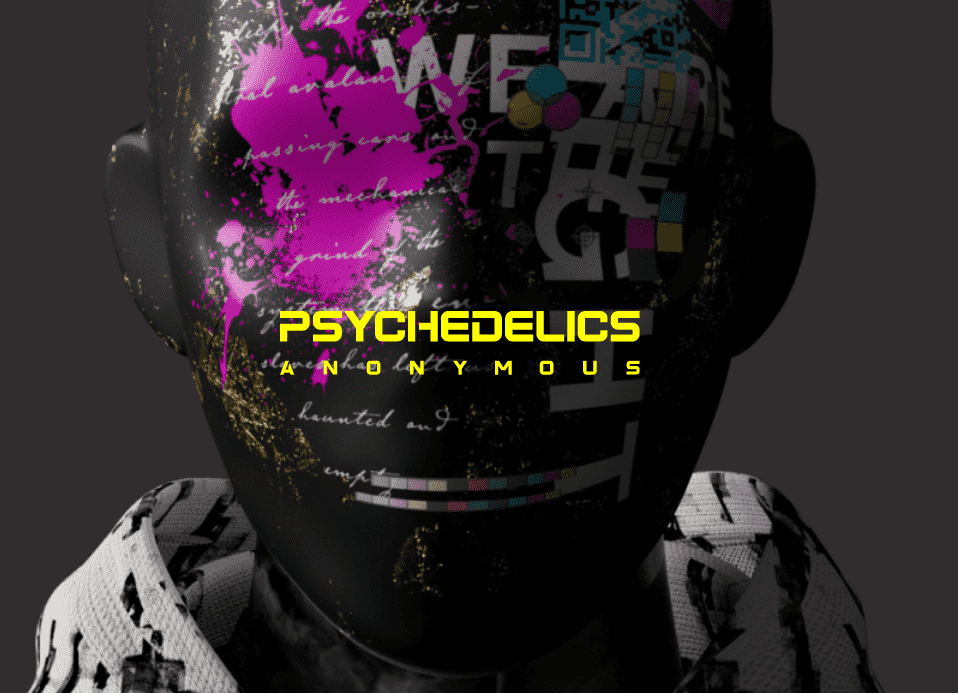

# Psychedelics Anonymous Component 1

Psychedelics 匿名组件 1 NFT - 常见问题（FAQ）
▶ 什么是迷幻匿名组件 1？
Psychedelics Anonymous Component 1 是一个 NFT（不可替代代币）集合。存储在区块链上的数字艺术品集合。
▶ 存在多少 Psychedelics Anonymous Component 1 代币？
总共有 5,037 个 Psychedelics 匿名组件 1 NFT。目前，1,088 位所有者的钱包中至少有一个 Psychedelics Anonymous Component 1 NTF。
▶ 最昂贵的 Psychedelics Anonymous Component 1 销售是什么？
出售的最昂贵的 Psychedelics Anonymous Component 1 NFT 是 Psychedelics Anonymous Component #1。它于 2022-06-06（3 个月前）以 812.6 美元的价格售出。
▶ 最近卖出了多少 Psychedelics Anonymous Component 1？
过去 30 天内售出了 346 个 Psychedelics Anonymous Component 1 NFT。
▶ Psychedelics Anonymous 组件 1 的价格是多少？
在过去 30 天里，最便宜的 Psychedelics Anonymous Component 1 NFT 销售额低于 250 美元，最高销售额超过 554 美元。过去 30 天 Psychedelics Anonymous Component 1 NFT 的中位价格为 428 美元。
▶ 什么是流行的 Psychedelics Anonymous Component 1 替代品？
许多拥有 Psychedelics Anonymous Component 1 NFT 的用户还拥有 Psychedelics Anonymous Component 2、Psychedelics Anonymous Printing Press、Psychedelics Anonymous Component 3 和 Metaverse Psychedelics Anonymous Pass。

