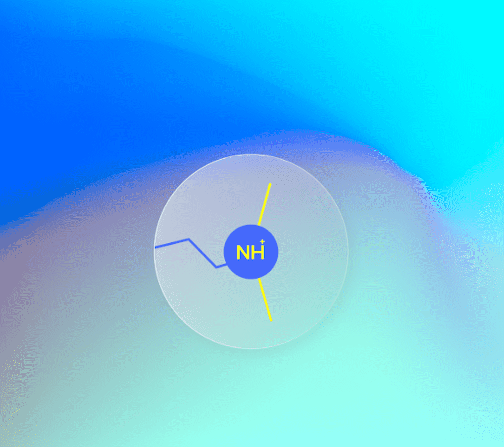

# Psychedelics Anonymous Component 3

Psychedelics 匿名组件 3 NFT - 常见问题（FAQ）
▶ 什么是迷幻匿名组件 3？
Psychedelics Anonymous Component 3 是一个 NFT（Non-fungible token）集合。存储在区块链上的数字艺术品集合。
▶ 存在多少 Psychedelics Anonymous Component 3 代币？
总共有 2,027 个 Psychedelics 匿名组件 3 NFT。目前，1,571 位所有者的钱包中至少有一个 Psychedelics Anonymous Component 3 NTF。
▶ 最昂贵的 Psychedelics Anonymous Component 3 销售是什么？
售出的最昂贵的 Psychedelics Anonymous Component 3 NFT 是 Psychedelics Anonymous Component #3。它于 2022-06-17（3 个月前）以 713.6 美元的价格售出。
▶ 最近卖出了多少 Psychedelics Anonymous Component 3？
过去 30 天内售出了 116 个 Psychedelics Anonymous Component 3 NFT。
▶ Psychedelics Anonymous Component 3 的价格是多少？
过去 30 天，最便宜的 Psychedelics Anonymous Component 3 NFT 销售额低于 247 美元，最高销售额超过 554 美元。过去 30 天 Psychedelics Anonymous Component 3 NFT 的中位价格为 435 美元。
▶ 什么是流行的 Psychedelics Anonymous Component 3 替代品？
许多拥有 Psychedelics Anonymous Component 3 NFT 的用户还拥有 Psychedelics Anonymous Component 2、Psychedelics Anonymous Printing Press、Psychedelics Anonymous Component 1 和 Metaverse Psychedelics Anonymous Pass。

