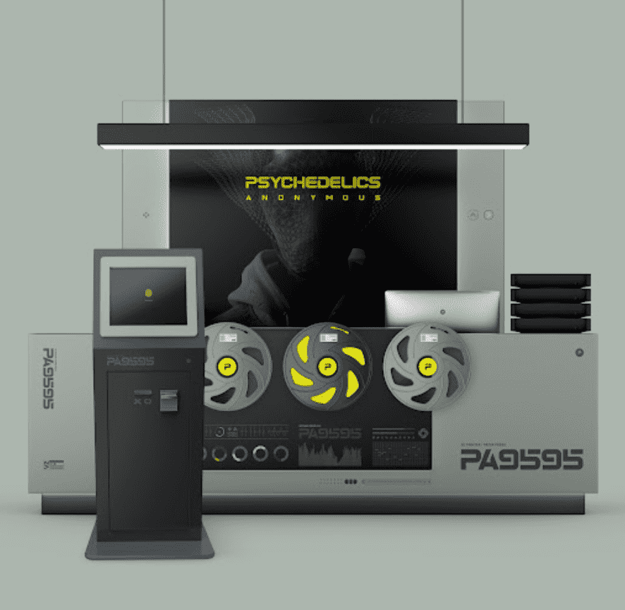

# Psychedelics Anonymous Printing Press

Psychedelics 匿名印刷机 NFT - 常见问题 (FAQ)
▶ 什么是迷幻匿名印刷机？
Psychedelics Anonymous Printing Press 是一个 NFT（不可替代令牌）集合。存储在区块链上的数字艺术品集合。
▶ 存在多少 Psychedelics Anonymous Printing Press 代币？
总共有 6,859 个 Psychedelics 匿名印刷机 NFT。目前，4,096 位所有者的钱包中至少有一台 Psychedelics Anonymous Printing Press NTF。
▶ 什么是最昂贵的 Psychedelics 匿名印刷机销售？
出售的最昂贵的 Psychedelics Anonymous Printing Press NFT 是 Psychedelics Anonymous Printing Press。它于 2022-06-11（3 个月前）以 554.3 美元的价格售出。
▶ 最近卖出了多少台 Psychedelics 匿名印刷机？
过去 30 天内售出了 350 个 Psychedelics Anonymous Printing Press NFT。
▶ Psychedelics 匿名印刷机要多少钱？
过去 30 天，最便宜的 Psychedelics Anonymous Printing Press NFT 销售额低于 235 美元，最高销售额超过 494 美元。过去 30 天 Psychedelics Anonymous Printing Press NFT 的中位价格为 329 美元。
▶ 有哪些流行的 Psychedelics 匿名印刷机替代品？
许多拥有 Psychedelics Anonymous Printing Press NFT 的用户还拥有 Psychedelics Anonymous Component 2、 Psychedelics Anonymous Component 1、 Psychedelics Anonymous Component 3和 Metaverse Psychedelics Anonymous Pass。

