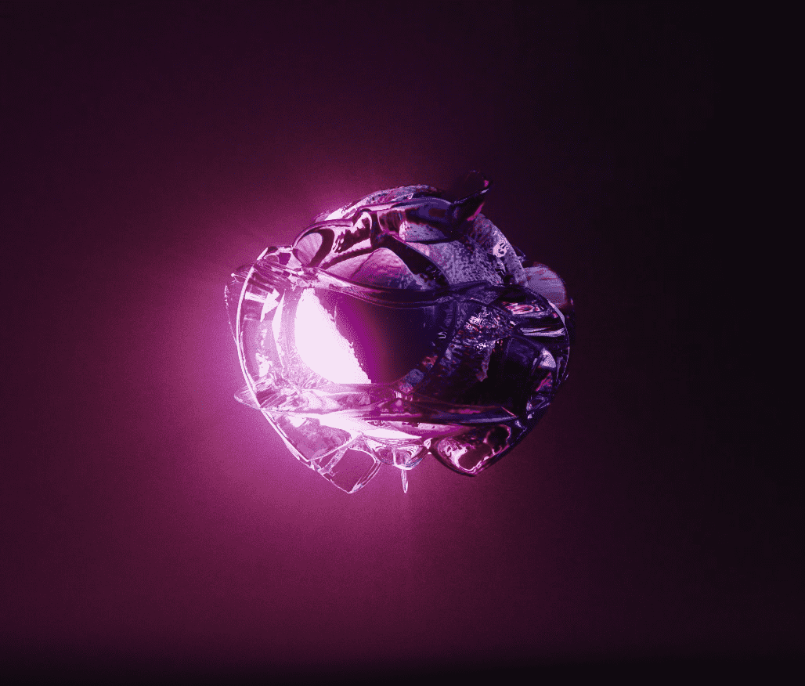

# Psychedelics Anonymous Psilocybin

Psychedelics Anonymous Psilocybin NFT - 常见问题（FAQ）
▶ 什么是迷幻药匿名赛洛西宾？
Psychedelics Anonymous Psilocybin 是一个 NFT（不可替代令牌）集合。存储在区块链上的数字艺术品集合。
▶ 存在多少 Psychedelics Anonymous Psilocybin 代币？
总共有 4,547 个 Psychedelics 匿名 Psilocybin NFT。目前，481 位所有者的钱包中至少有一个 Psychedelics Anonymous Psilocybin NTF。
▶ 最昂贵的 Psychedelics Anonymous Psilocybin 销售是什么？
最昂贵的 Psychedelics Anonymous Psilocybin NFT 是 Psychedelics Anonymous Psilocybin。它于 2022 年 6 月 7 日（3 个月前）以 930 美元的价格售出。
▶ 最近卖出了多少 Psychedelics Anonymous Psilocybin？
过去 30 天内售出了 349 个 Psychedelics Anonymous Psilocybin NFT。
▶ Psychedelics Anonymous Psilocybin 的价格是多少？
在过去 30 天里，最便宜的 Psychedelics Anonymous Psilocybin NFT 销售额低于 932 美元，最高销售额超过 2404 美元。过去 30 天 Psychedelics Anonymous Psilocybin NFT 的中位价格为 1427 美元。
▶ 什么是流行的 Psychedelics Anonymous Psilocybin 替代品？
许多拥有 Psychedelics Anonymous Psilocybin NFT 的用户还拥有 Psychedelics Anonymous Printing Press、Psychedelics Anonymous Component 1、IRL Psychedelics Anonymous Pass 和 Metaverse Psychedelics Anonymous Pass。

