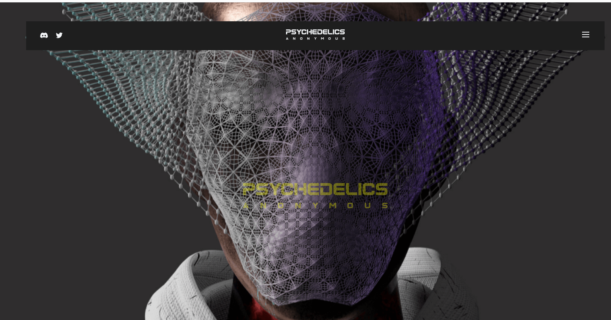

# PsychedeIics Anonymous: Genesis

我们是黑夜在我们睡觉的日光之下，过往车辆的管弦乐雪崩和奴役系统的机械研磨让我们感到困扰和空虚。当我们推拉时，我们像静电一样在拥挤的噪音中起起落落——我们阳光般的头脑不断地蒙上阴影。寂静的日子陷入疲惫的几个月——存在的重复。只有黑夜的裹尸布才能提供救赎，黑色的毯子可以避免孤立的启示。

在零时，我们聚集在黑暗中寻找通往外部世界的内在路径——逃离我们发条生活的虚假梦想。我们在同步的小夜曲中像狼一样嚎叫，寻找机器——幽灵般的神殿。我们正在醒来。连接这些机器——被群众的日常磨练和他们稀释的系统孕育的遐想所掩盖的黑暗休眠纪念碑——在虔诚的宁静中等待夜幕降临。模糊的黑曜石轮廓与奇异的照明形成鲜明对比——“旅途愉快——迷幻匿名者”当乌鸦苍穹降临时，这些机器还活着——变成了令人陶醉的霓虹巨石，低语着治愈我们被污染的幻想。

