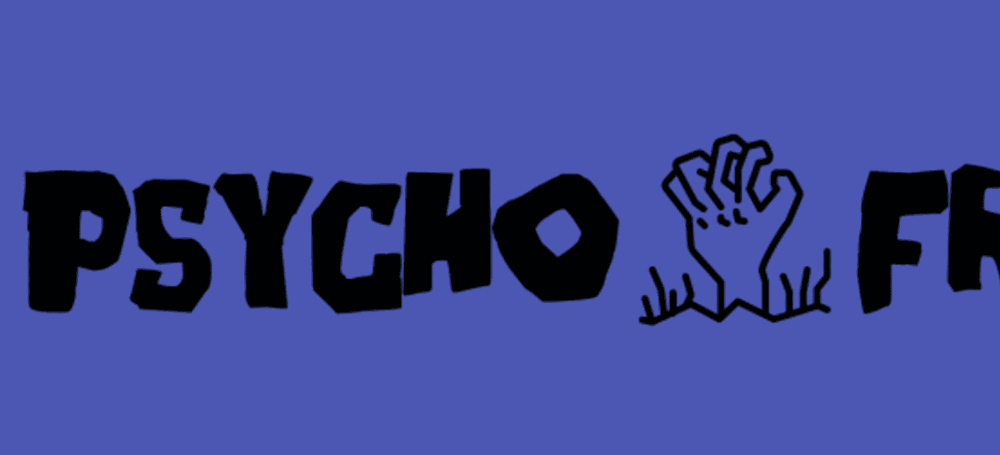

# Psycho Frens .

Psycho Frens 是一个以社区为重点的衍生 NFT 集合，包含 9,999 个稀有 Nft。 每个 NFT 都是使用 140 多种属性（如帽子、眼睛、皮肤等等）的组合通过算法生成的！ Psycho Fren 在以太坊 (ETH) 区块链上推出，旨在以可承受的价格提供高质量的艺术品，同时执行广泛的路线图。
精神病人。NFT - 常见问题（FAQ）
▶ 什么是精神病患者。？
精神病人。是一个 NFT（不可替代代币）集合。存储在区块链上的数字艺术品集合。
▶ 多少精神病患者。代币存在吗？
总共有 100 个 Psycho Fren。NFT。目前 2 位拥有者至少拥有 1 个 Psycho Frens 。NTF 在他们的钱包里。
▶ 多少精神病患者。最近有卖吗？
有 0 个精神病人。过去 30 天内售出的 NFT。

