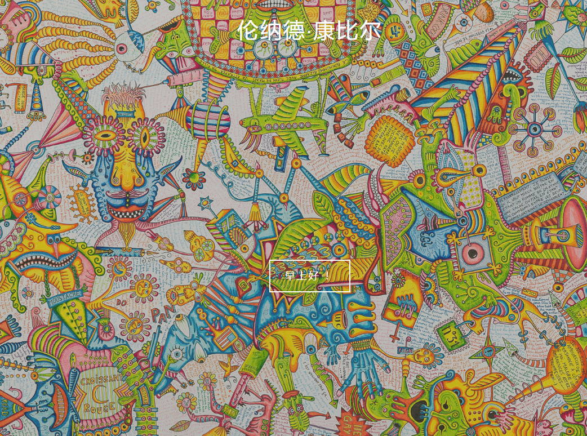

# psycho mfers in Paris

从巴黎街头到元宇宙代币获得对 Leonard Combier 未来工作的特权访问

伦纳德·康比尔的作品就像一个永远无法完全解开的谜。有些事情总是会溜走你的注意或逃过你的眼睛，抵制你试图解开每一个线索的企图。事实上，这位年轻的法国艺术家的想象力如此狂野，以至于他的每一件作品都是一个独立的世界。
 

自学成才的康比尔自会握铅笔以来，就一直被艺术创作的狂热所驱使。他的绘画逐渐发展和复杂化，最终说服他离开了著名的商学院，全身心地投入到他的艺术中。然而，他研究的严谨性和理性在他的画作中闪耀，因为每幅画都设定了自己的社会、规则、风景和发明范式。事实上，康比尔作为艺术家的才能与他作为讲故事的技巧相媲美，它们的融合产生了一个神奇的宇宙。一个神奇的宇宙，让人想起刘易斯卡罗尔为爱丽丝创造的那个世界，因为她在大小不断变化的多个世界中进行选择；或者是 Mary Poppins 在跳过一幅画时发现的那个；甚至是《盗梦空间》中的那个，不同层次的意识发挥作用的地方。因此，康比尔的工作需要集中注意力和接受能力。 

