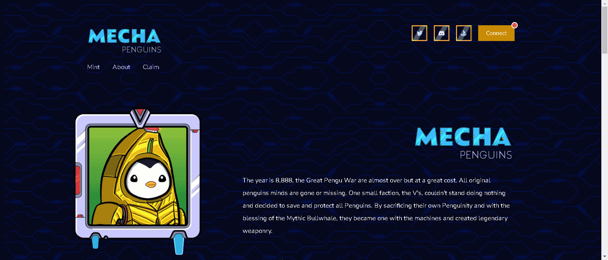

# Puddly Penguins

Puddly Penguins 是 3,500 只企鹅在以太坊上充满爱意，由 Penguins 为 Penguins 制作

8888年，大企鹅大战快结束了，但付出了巨大的代价。所有原始企鹅的思想都已经消失或失踪。一个小派系，V's，无法忍受无所作为，决定拯救和保护所有企鹅。通过牺牲自己的企鹅，在神话牛鲸的祝福下，他们与机器合二为一，创造了传奇的武器。

