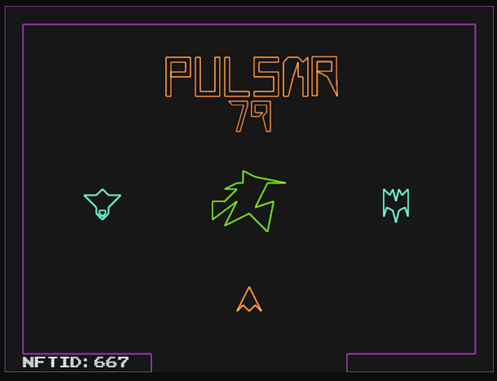

# Pulsar79

脉冲星 79
作为 Genesis 项目，Pulsar 79
从 70 年代的第一波电子游戏中汲取灵感。 受基于 Vector 的 Arcade 游戏与程序生成和现代创新相结合的启发，该项目展示了使用生成式互动艺术所有权的潜力。
故事
一千个世界，所有熟悉的，不同的，但相互联系的。 你会发现自己处于一个封闭的环境中，只有一个方向可走。 感觉就像你以前来过这里，但情况有所不同。 只有一条路可以走，你需要找到离开这个地方的路。 多个房间有多个障碍，不同的拾音器一路改进，只有一个目标。
探索你自己独特的游戏版本，获得尽可能高的分数，或者让它成为一个快速运行并获得最快的时间！

