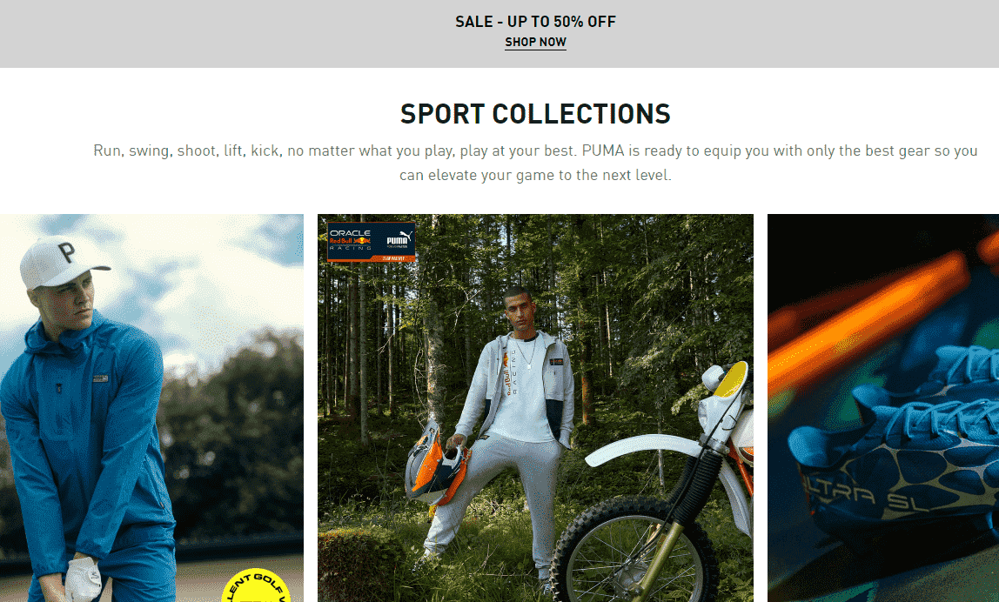

# PUMA Nitro Token OFFICIAL

PUMA 拥有和运营的第一个 Nitro NFT 项目展示了该品牌的未来，将 4,000 个 NFT 分为两种设计， 和 。考虑到 Metaverse 开发，这两个项目将解锁访问 PUMA 的 Web3 社区、高级体验和掉落。任何在 8 月 28 日之前未用于申领 Nitropass 的代币都将被销毁。

奔跑、挥杆、投篮、举重、踢腿，无论你玩什么，都尽你所能。PUMA 已准备好为您配备最好的装备，这样您就可以将您的比赛提升到一个新的水平。

什么是 PUMA METAVERSE ORGLNALS 官方？

PUMA METAVERSE ORlGlNALS OFFICIAL 是一个 NFT（不可替代令牌）集合。存储在区块链上的数字艺术品集合。

有多少 PUMA METAVERSE ORlGlNALS 官方代币存在？

总共有 24 个 PUMA METAVERSE ORGLNALS 官方 NFT。目前 2 位所有者的钱包中至少有一个 PUMA METAVERSE ORlGlNALS OFFICIAL NTF。

最近卖出了多少 PUMA METAVERSE ORlGlNALS OFFICIAL？

在过去 30 天内售出 0 份 PUMA METAVERSE ORGLNALS 官方 NFT。

