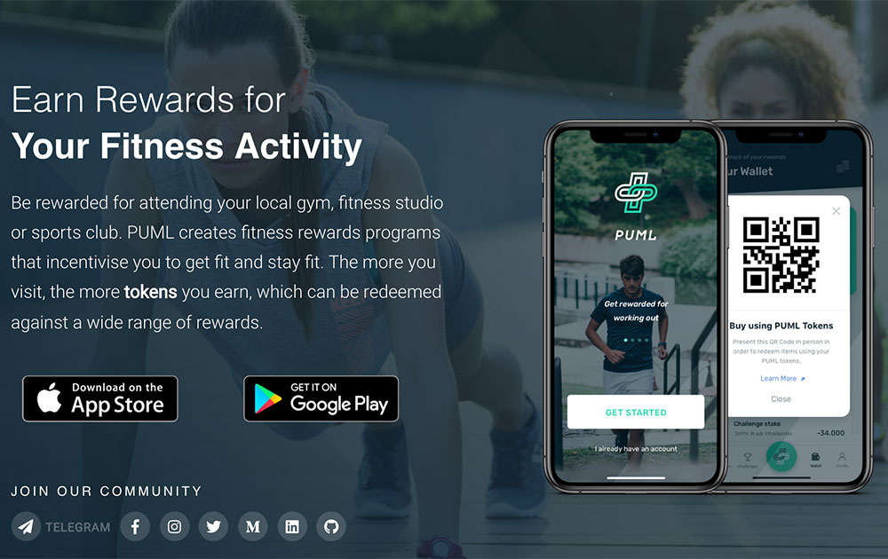

# PUML Better Health

**什么是 PUML Better Health？**

PUML 是一个区块链健康和健身项目，它可以安全地存储和保护健身数据，同时通过我们独特的健康和健身奖励协议奖励用户。通过赞助挑战、微数据奖励、质押活动和第 3 方数据优惠赚取代币。

在 PUML 数字健康和健身市场中使用代币。

加入 Web3 革命。完成步数、补水、冥想、睡眠等健康挑战，获得加密货币奖励。

**加入挑战并开始行动**

企业、品牌和专业运动员赞助健康的生活、身心挑战，让您参与其中。这些挑战包括冥想、补水、步数、睡眠等等。它们都旨在帮助您养成健康的习惯，同时也因此获得回报。

