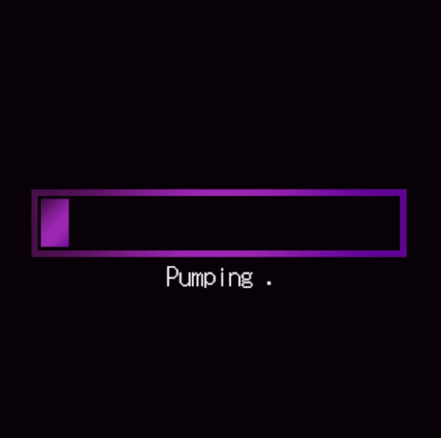

# PumpAndDump.io

首先是泵和倾倒。 然后是地毯。
PUMPandDUMP.io NFT - 常见问题（FAQ）
▶ 什么是 PUMPandDUMP.io？
PUMPandDUMP.io 是一个 NFT（非同质代币）集合。 存储在区块链上的数字艺术品集合。
▶ PUMPandDUMP.io 代币有多少？
总共有 2,222 个 PUMPandDUMP.io NFT。 目前 326 位所有者的钱包中至少有一个 PUMPandDUMP.io NTF。
▶ PUMPandDUMP.io 最昂贵的销售是什么？
卖出的最昂贵的 PUMPandDUMP.io NFT 是 #38。 它于 2022 年 7 月 3 日（2 个月前）以 1.1 美元的价格出售。
▶ 最近卖了多少PUMPandDUMP.io？
过去 30 天内售出了 1 个 PUMPandDUMP.io NFT。

