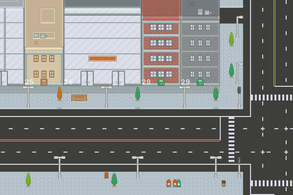

# Pumpopoly

Pumpopoly 是一款让人想起经典棋盘游戏的虚拟房地产模拟器。该游戏可在所有设备上玩，在动画 HTML5 画布上具有像素艺术。

游戏玩法很简单。玩家每走一步都从国库中收取薪水。只需点击“Drive & Claim”即可领取您的薪水！ 

在玩家拥有的土地上停车的玩家向房东支付租金。所有城市拥有的物业均可免费停车。在这种简单性之下存在更深层次的增量点击游戏机制。

与经典棋盘游戏不同，Pumpopoly 不包含固定数量的属性。当玩家购买或改善财产时，会增加新的土地。这种机制保证租金的平均成本总是低于支付的工资。以更高的价格添加新土地，以确保您的满意。

通过购买更多土地或邀请朋友来升级。当您的朋友购买土地时，可获得 50% 的奖金。通过 5 个级别的进步，并在每一步升级你的土地。建造更大的建筑物以最大化您的租金收入。最好的建筑有 16 倍的租金乘数！

玩家可以在游戏内市场买卖土地或出口到 NFT。Pumpopoly 代币可以在 ref.finance 进行交易。

免费试用我们的测试网。如果您需要帮助，请在 Discord 上询问。该游戏具有完整的教程和常见问题解答。
