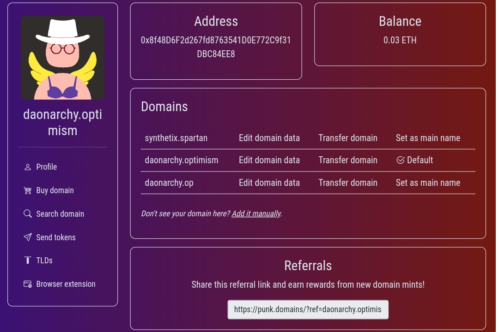

# Punk Domain

Punk Domains 允许您注册附加到您的帐户地址**的域名。**

### 为什么会有人需要它？

好吧，你的加密地址很难记住。它以 开头`0x`，然后以 40 个随机字符（从 to 的数字和从to`0`的`9`字母）继续。`a``f`

如果您希望有人向您发送代币，请确保您可以将您的地址发送给他们，他们可以将其复制粘贴到他们的钱包中。但是，如果他们可以只输入一个域名`techie.wagmi`而不是整个地址，那不是很好吗？

这是他们可以做的`punk.domains`（在发送令牌页面上）。

另一个用例是将域名作为您在各种 web3 dApp、游戏和即将推出的社交网络中的**用户名。**而不是您的用户名`0xb29…45D`，它可能是`techie.wagmi`。

Punk Domains 提供的一项附加功能是**浏览器扩展**，如果您在浏览器 URL 栏中键入域名，它会将您带到指定的 URL 地址。

### 但是，这不就是 ENS 已经在做的吗？

是的，但他们只在以太坊 L1 和（目前）只使用`.eth`. Punk Domains 允许许多不同的顶级域 (TLD)，例如`.wagmi`,`.ape`等`.opti`。它在 L2 链上运行。

Punk Domains 使任何人都可以创建 TLD、运营它并从中赚取收入。例如，像 Aave 这样的 DeFi 协议可以创建一个名为 的 TLD `.aave`，每次购买的收入都会进入 Aave 的国库。

Punk Domains 架构**非常灵活**，它允许各种领域业务模型。第一个是一次性域名购买（无续订），但未来会添加新的（例如有时间限制的域名所有权）。

### 不仅仅是域名

朋克域不仅仅是域（在 web2 的意义上）。这是关于web3 世界中的**身份**。域名为您提供了一个数字身份，而附加到该身份的数据则加强了它。

Punk Domains 珍视的另一件事是**完全去中心化**。这些合约是不可升级的，并且不需要任何管理员（或类似的外部软件）来正常运行。唯一尚未去中心化的是主要工厂合同所有权（决定新 TLD 价格的那个） - 但请继续关注......😉
