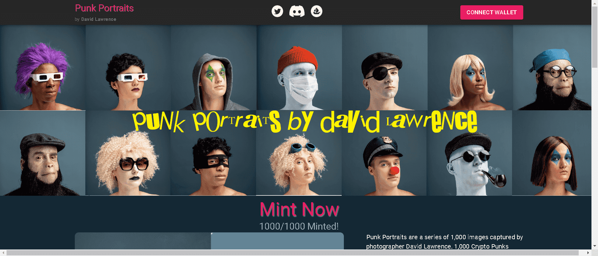

# Punk Portraits by David Lawrence

1,000 名朋克逃离了区块链，足以与肖像摄影师大卫劳伦斯进行工作室会议。在他们回到区块链后，他们的肖像被铸造以纪念这一时刻。该合集是脱离 OpenSea 共享合约后的官方合集。查看opensea 上的历史摄影统计数据，您会发现该系列在前 30 名中，在迁移之前已完成近 100 ETH 的销售额。

该项目最初是使用 OpenSea 共享店面合约启动的，团队已应收藏家社区的要求决定迁移到自定义 ERC-721 代币。

