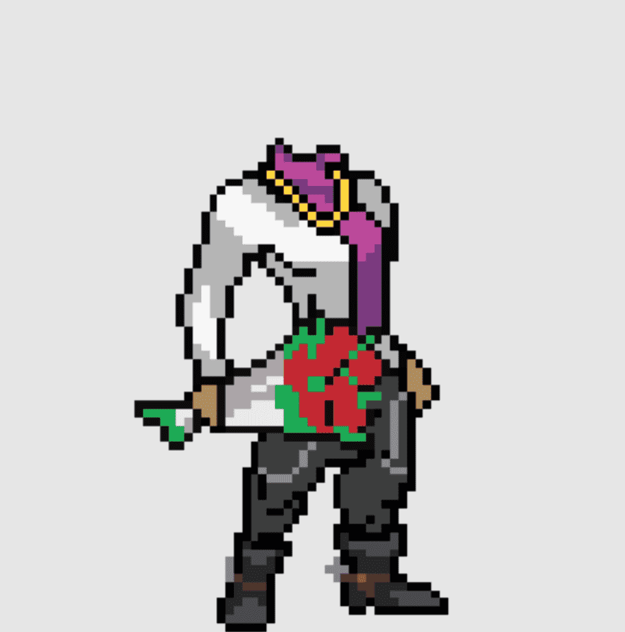

# PunkBodies

PunkBodies是艺术家设计和机器生成的基于以太坊区块链的身体像素艺术图像，与现有的 CryptoPunks 相得益彰。有 10,000 具尸体，每具尸体都与现存的每一个朋克的类型和肤色相得益彰。使用PunkBodies，您可以组合和组成朋克和身体的新组合，创建一个完整的可铸造化身，我们将其称为Punkster。在展示页面上匹配、混合和铸造任何身体和朋克组合。
有兴趣购买 Punkster（Punk + Body 组合）吗？前往朋克斯特系列。
在 4 月 11 日之前，Punk 所有者可以免费空投。您还可以在PunkBodies.com上建造一个壁橱并铸造任意数量的身体

