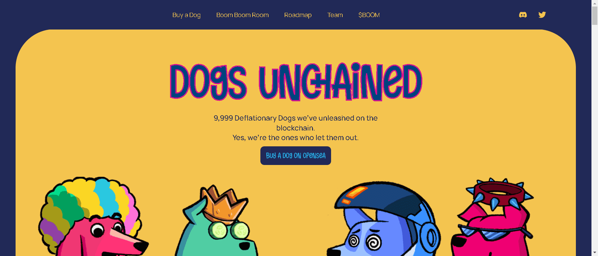

# Puppies Unchained

Puppies Unchained 是授予已达到 5 级或以上的 Dogs Unchained 所有者的独特 NFT。他们以 7 倍于狗的速度赚取 $BOOM 代币。

Dogs Unchained 是 NFT 收藏家、爱狗人士和 IRL 狗在区块链（和元界）上的社区。每只狗都是具有通货紧缩机制的 ERC-721 代币，供应量仅从 9,999 个减少：通过全新的区块链技术，您可以在 Boom Boom Room 中混合两只狗，选择性地组合它们的特性，并创建一个超级狗。重要的是，成员们将在铸币时通过慈善机构支持狗，并在虚拟世界中纪念他们令人惊叹的 IRL 犬。

