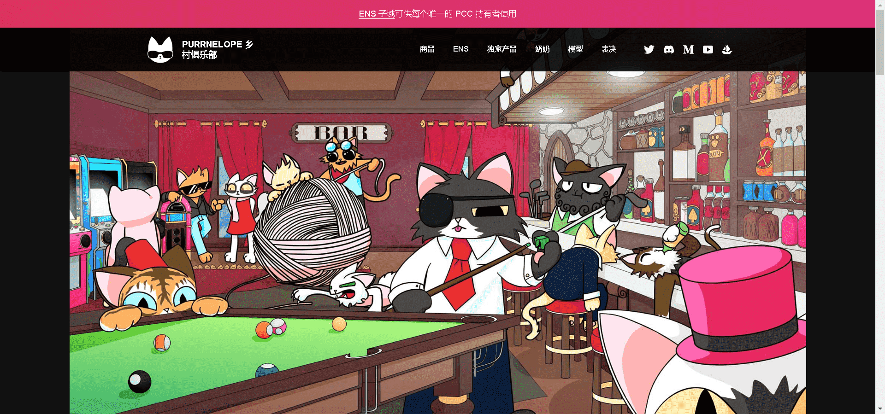

# Purrnelopes Country Club

Purrnelope 的乡村俱乐部是存在于以太坊区块链上的 10,000 个随机生成的 NFT 的集合。排他性是名称，乐趣是游戏。

Purrnelope 建立她的乡村俱乐部的想法是建立一个具有强烈社区感觉的俱乐部。

猫可以在某个地方聚在一起喝杯东西并吹微风。

猫可以在某个地方讨论和辩论如何帮助我们的星球并真正做一些好事。

在某个地方，每只猫都是特别的，每个人都受到欢迎。

购买猫会让您成为这个特殊乡村俱乐部的会员，并有助于解锁我们路线图中详述的会员福利。

