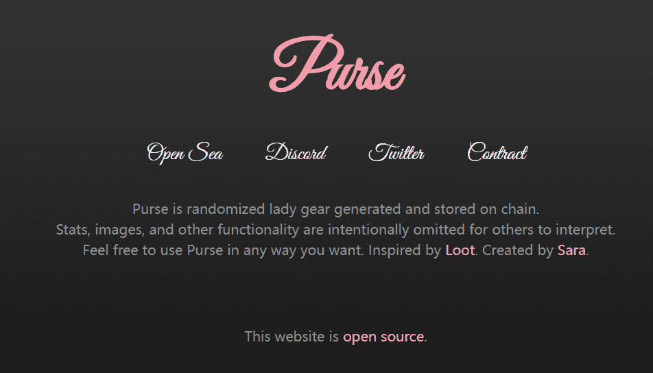

# Purse Project

钱包是随机生成并存储在链上的女士装备。
故意省略统计信息、图像和其他功能以供其他人解释。
随意以任何你想要的方式使用钱包。灵感来自于战利品。由萨拉创建。

利品是随机生成并存储在链上的冒险家装备。故意省略统计信息、图像和其他功能以供其他人解释。随意以任何你想要的方式使用 Loot。

8,000 个装满战利品的袋子，由冒险家发现。哪儿来的呢？他们有什么故事？收集一个包，了解它的故事，然后开始你的冒险。

