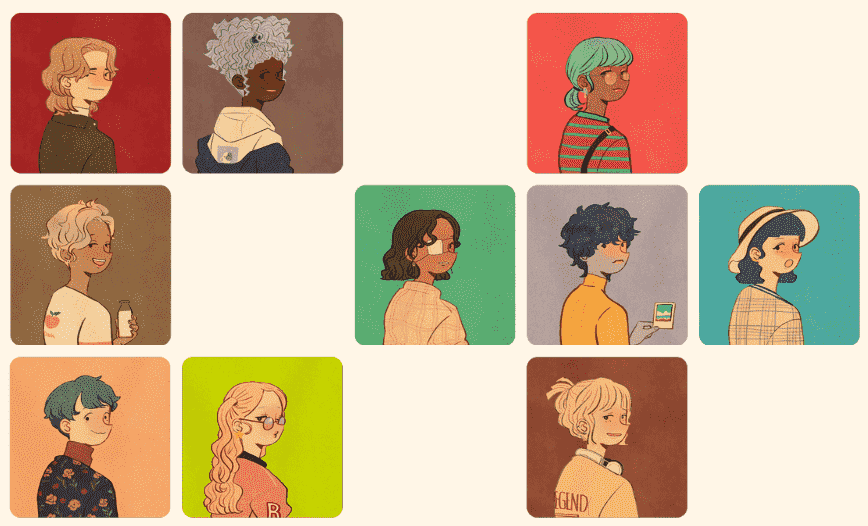

# Puuung Friends

Puuung 的第一个 PFP NFT 项目——存储在以太坊区块链上的 1,000 个独特的收藏角色。Puuung Friends 不是一种生成艺术；这是 Puuung 精心手绘的具有多种特征的艺术品。随着新的故事，Puuung Friends 将出现在 Puuung 的动画世界中。 Puuung 是一位享誉全球的韩国插画家和动画师，在 Youtube、Facebook、Instagram 和 Twitter 上拥有 320 万全球观众。自 2014 年以来，Puuung 创作了许多艺术作品，传播快乐的氛围，让世界更快乐。

Puuung 在韩国出生和长大，是一位插画家和动画师，热爱美丽的空间、爱情故事、动画和游戏。她因创作能够捕捉日常生活中爱的闪亮时刻的艺术品而受到全世界的喜爱。 不分性别、年龄、国籍，很多看过她作品的人都会说：“我想生活在Puuung美丽的世界里！” 原因是她捕捉并展示了每个人都想要的纯粹的爱的情感。她还分享了我们日常生活中很容易被忽视但每个人都能产生共鸣的闪光时刻。以 D 和 M 等首字母命名的角色以及难以猜出原籍国的匿名背景也有助于观众将他们的情感融入到不同语言和文化之外的角色中。基于日常生活中的爱和幸福的同理心是确保 Puuung 的作品在世界范围内受到赞赏的关键因素。

