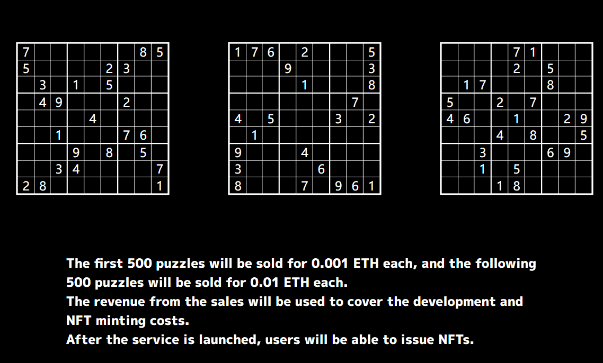

# Puzzle (Number Place)

前 500 个拼图每个售价 0.001 ETH，接下来的 500 个拼图每个售价 0.01 ETH。
销售收入将用于支付开发和 NFT 铸造成本。
服务启动后，用户将能够发行 NFT。

Puzzlelink 是一个以社区为中心的益智网站。
我们的目标是成为一个以 NFT 为核心的拼图网站，可以与拼图创作者分享收入。

我们的目标是成为世界上最好的拼图网站，拼图创作者可以聚在一起分享收入。

Puzzlelink 推出了世界上第一个 Puzzle NFT。
拼图数据都在链上，并且可以从拼图数据中生成缩略图，使其成为一个完整的链上 NFT。

我们的愿望不仅是创建 NFT，而是创建一个拼图创造者社区。

NFT 本身只是工具，重要的是你用它做什么以及通过使用它可以实现什么。
到目前为止，拼图创作者还没有得到应有的赞赏。我们希望创造一个创造者可以控制的世界。

我们自己就是创造者，制作游戏。
这就是为什么我们希望看到一个创造者聚集在一起并获得激励的世界。
我们自己就是创造者，制作游戏。这就是为什么我们要创造一个世界，鼓励拼图创作者聚在一起创造令人惊叹的拼图。到目前为止，NFT 以转售版税的形式为艺术家带来了激励。我们相信拼图创作者应该和艺术创作者一样受到赞赏。

我们希望创建一个拼图爱好者、拼图创作者和各种各样的人可以聚在一起享受拼图的社区！

