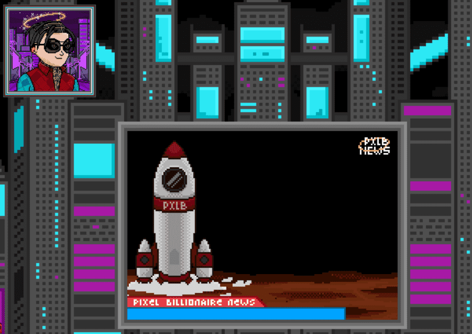

# PXLB Official

Pixel Billionaire 是 222 名血统的继承人和 3666 名白手起家的亿万富翁的创世纪系列。持有者将被授予对帝国元宇宙的独家访问权，并将获得 $CASH 代币。亲身体验互动式豪宅/房产，通过“信托基金”申领继承人，并通过收购资产组合来增加您的净资产。

Pixel Billionaire (PXLB) 的愿景是建立一个以游戏化货币 $CASH 为基础的互联 NFT 社区。从一系列看起来很酷的亿万富翁的化身开始，然后扩展到豪宅/房产的所有权，然后这些豪宅/房产的所有权将为继承人提供“信托基金”，从豪宅到超级跑车等各种资产类别中收购优质资产。更进一步，该计划是实施高风险游戏，持有者可以通过投注获得的资产获得乐趣——所有这些都建立在亿万富翁的生活方式概念之上。我们的路线图 2.0 元节将由雄心勃勃的元节合作伙伴谁将把这一切变为现实，同时我们将继续探索与其他元宇宙平台的合作伙伴关系并扩大像素亿万富翁帝国，为我们的持有者提供各种选择来享受 web3。

Destate NFT是我们的独家合作伙伴，他将建造我们的元宇宙就绪豪宅。他们是一支由工程师和建筑师组成的高度专业化的团队。到目前为止，我们已经从社区收到了关于偷看的惊人回应（它们也带有完全渲染和详细的内饰！）。这些豪宅将是互动的、宜居的、可出租的，当然还有可翻转的。您甚至可以对它们进行翻新，将它们变成您的数字家园。

