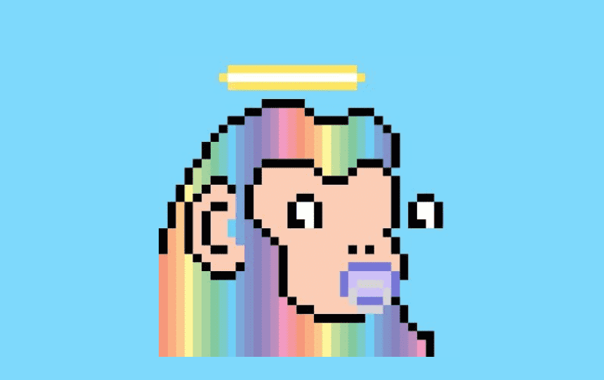

# Pixel Doodle Kongz

如果您不属于能够负担得起 BAYC、Cool Cats、Doodles 或 CyberKongz 的少数收藏家或鲸鱼，您可能已经发现了一些被称为衍生品的新兴收藏品。简而言之，它们是下一个最好的东西。由于初始价值低得多，而且通常是高度积极的、超级精神的社区，围绕这些项目的嗡嗡声非常重要。

最新添加的是一个名为 Pixel Doodle Kongz 的独特混搭。受到他们现有的拥有 Cyberkongz 和 Doodles 的竞争的启发，这个衍生系列的创始人发现自己在他们拥有的哪个蓝筹股更好的问题上存在分歧。Doodle 所有者 Brooksan 和 Cyberkongz 骑或死的 Neo 都认为他们各自的社区是不可逾越的。让我们不要忘记提及独特的艺术：谁不喜欢可爱的、柔和的、caddywhompus 眼睛的涂鸦或孔本人凶猛但时髦的像素化头像？

NFT 领域见证了新项目的不道德激增，以及对已证明可行的衍生艺术的同时兴趣。Brooksan 和 Neo 决定与普通铸币者分享他们对 Doodles 和 CyberKongz 以及整个 NFT 社区的热情。

