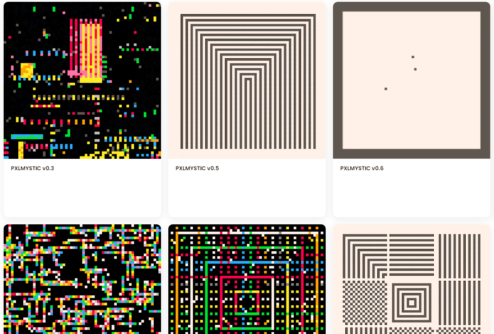

# PXLMYSTIC v0

我不确定这对除我以外的任何人是否有帮助或有意义，但我希望它存在一段时间，所以我做到了。

什么是 PXLMYSTIC v0？

PXLMYSTIC v0 是一个 NFT（非同质代币）集合。存储在区块链上的数字艺术品集合。

存在多少 PXLMYSTIC v0 代币？

总共有 7 个 PXLMYSTIC v0 NFT。目前 6 位所有者的钱包中至少有一个 PXLMYSTIC v0 NTF。

最昂贵的 PXLMYSTIC v0 销售是什么？

出售的最昂贵的 PXLMYSTIC v0 NFT 是 PXLMYSTIC v0.1。它于 2022-06-12（3 个月前）以 153.9 美元的价格售出。

最近卖出了多少 PXLMYSTIC v0？

过去 30 天内售出了 2 个 PXLMYSTIC v0 NFT。

