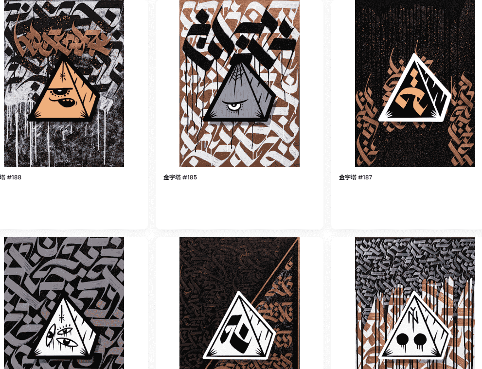

# PYRAMYD

PYRAMYD 是来自布宜诺斯艾利斯市的一位年轻多产的艺术家。他的作品通过混合各种技术和资源实现，专注于创造独特的宇宙，将物理、数字和空灵融为一体。

9 月份，他强迫自己在工作室里住了 30 天。决心每天创作一幅画，PYRAMYD 从极端体验中脱颖而出，推出了一系列令人惊叹的独特作品，这些作品构成了他 NFT 系列的支柱。这是 PYRAMYD x Samot Club。

拉丁美洲艺术、音乐和文化与 NFT 相遇的地方。

